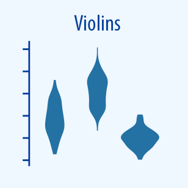

# Visualization Techniques in Python
The main idea of this repository is present all most poular visualizations in python. The repository is divided into 5 segments that refer to what exactly we want to present.

# Content of repo:

<h3>Distribution</h3>

- Histogram  

- Density plot  

- Stacked histogram  

- Stacked density plot
- Overlapping histogram
- Overlapping density plots  

- Ridge plot  

- Population pyramid
- Q-Q plot  

- Logarithmic scale
- Box plot  

- Violin plot  

- Strip plot  

<h3>x-y relationships</h3>

- Scatterplot  

- Bubble plot  

- 2D density plot  

- Heatmap for correlation  

- Line plot  

- Averaging trends
- Area plot
- Linear regression
- Deleting trends
- 2D line plot and time series
- Principal Components analysis

<h3>Amounts</h3>

- Bar chart  

- Stacked bar chart  

- Grouped bar chart  

- Dot chart  

- Heatmap for quantity  

<h3>Proportions</h3>

- Pie chart  

- Bar plot  

- Sequence of stacked bar plots  

- Stacked density plots (proportions)  

- Waffle chart
- Treemap plot  

<!-- - Parallel sets plot -->

<h3>Uncertainty</h3>

- Difference between standard deviation and standard error
- Error bar  

- Confidence intervals in regression  

<!-- - Hypothetical Outcome Plots (HOP) -->
<!-- Source <a href="https://github.com/ShuaiGuo16/Hypothetical_Outcome_Plots">here</a>.
Informations <a gref="https://towardsdatascience.com/quick-start-to-gaussian-process-regression-36d838810319">here</a>. -->

<h3>Geospatial</h3>

- Chloropleth  

- Interctive chloropleth
- Points on map
- Interavtive points on map
- Cartogram heatmap

✉︎ maksymiliannorkiewicz@gmail.com
